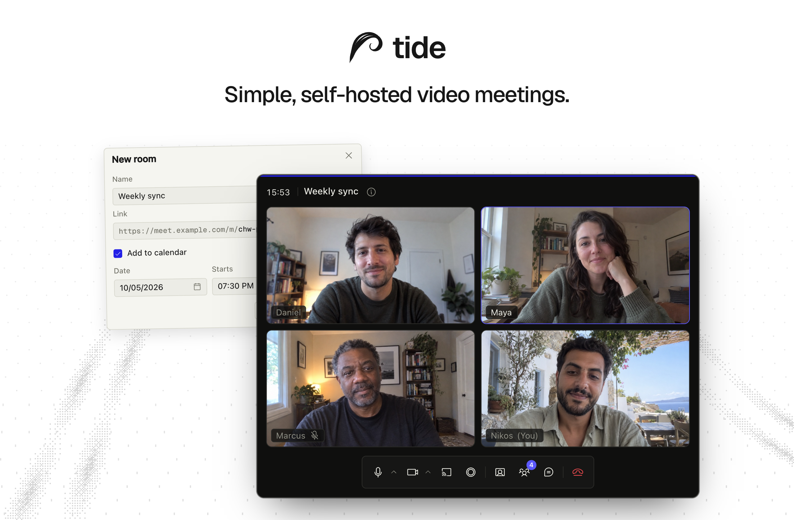

<p align="center">
  <a href="https://tide.convex.works">Website</a> ·
  <a href="https://demo.tide.convex.works">Demo</a> ·
  <a href="docs/DEPLOYMENT.md">Deployment</a> ·
  <a href="docs/ARCHITECTURE.md">Architecture</a>
</p>

tide is a self-hosted video meeting service. Its Go binary embeds the SvelteKit
web app and LiveKit media server. Optional recording uses LiveKit Egress,
Redis, and S3-compatible storage.

- Meeting links with custom slugs and downloadable calendar invites (`.ics`)
- Microphone, camera, screen sharing, device selection, and automatic reconnection
- Guest lobby with host controls to admit, deny, mute, remove, and end meetings
- Per-participant video hiding for the current viewer
- Ephemeral in-room chat
- Optional audio and video recording, with download and delete controls

## Quickstart

Requires Go 1.26 or later and Node 22 or later. From the repository root:

```sh
npm ci --prefix web
make build
./bin/tide
```

With no `TIDE_*` environment variables set, tide runs in anonymous mode at
`http://localhost:8080`. Create and join a room, then open its meeting link in
a private window to join as a guest. Admit the guest from the host's People
panel.

In anonymous mode, anyone who can reach the server can create a room. The
browser that creates it owns it. Unused rooms expire after 24 hours; restarting
tide clears every room.

## Deployment

Configuration selects the mode:

| Mode                     | Enabled by                | Room storage | Processes             |
| ------------------------ | ------------------------- | ------------ | --------------------- |
| Anonymous                | No OIDC issuer            | In memory    | tide                  |
| Signed in                | `TIDE_OIDC_ISSUER`        | SQLite       | tide                  |
| Signed in with recording | OIDC + `TIDE_S3_ENDPOINT` | SQLite       | tide + Egress + Redis |

Sign-in requires an OIDC provider and session and client secrets. Guests join
with a display name and do not need an account. Recording also requires an
S3-compatible bucket, storage credentials, and shared media and Redis secrets.

For production, serve tide behind an HTTPS proxy that forwards WebSocket
upgrades. Media reaches the server directly over UDP 7882, with TCP 7881 as a
fallback. The [deployment guide](docs/DEPLOYMENT.md) covers the binary, Docker
Compose, Kubernetes, and all required configuration.

Restarting tide restarts its embedded media server and ends live meetings and
recordings. An [external media server](docs/DEPLOYMENT.md#external-media-server)
can keep meetings running across a tide restart.

## Recording

Hosts can record audio as OGG or the meeting layout as MP4. Files go to the
configured S3-compatible bucket and appear in the room's recording list for
download or deletion.

Recording runs on the server and continues if the host closes their tab while
other participants remain. It stops when explicitly stopped or when the room
empties.

## Development

Install the web dependencies as in Quickstart, then run:

```sh
make dev
```

This requires Docker with Compose. It starts Dex, MinIO, Redis, and Egress in
containers, with the Go server and Vite on the host. Open
`http://localhost:5173` and sign in with `host@tide.dev` / `tide-dev`.

`make dev` detects the LAN address on macOS and writes it to `deploy/.env`.
On Linux, set `TIDE_MEDIA_NODE_IP=<your LAN address>` in `.env` at the
repository root so the recorder can reach the media server.

Stop the Go server and Vite with Ctrl-C. Stop the containers with:

```sh
docker compose -f deploy/compose.yaml down
```

## Checks and tests

```sh
make check   # Go vet/tests, web type/format checks, generated API type drift
make gen     # regenerate TypeScript API types from Go
make build   # build bin/tide with the web app embedded
```

`make check` must pass before committing. API wire types live in
`server/internal/api`; regenerate them with `make gen` after a change.

The media gate tests real meetings and recording in its own Docker Compose
stack. It runs lifecycle, reliability, fuzz, and network-chaos scenarios in CI
on every pull request:

```sh
make media
make media-dev ARGS="media-lifecycle.spec.ts --project=chromium"
```

`make media` builds and tears down the stack. `make media-dev` keeps it running
and rebuilds changed code for iteration. Stop that stack with
`make media-dev ARGS="--down"`.

The [architecture contract](docs/ARCHITECTURE.md) defines the system, API,
authorization rules, design language, and frozen feature scope.

## License

[MIT](LICENSE)
